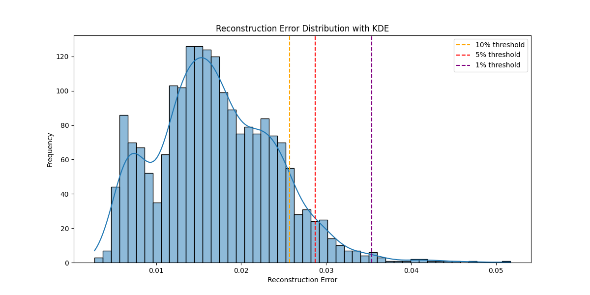
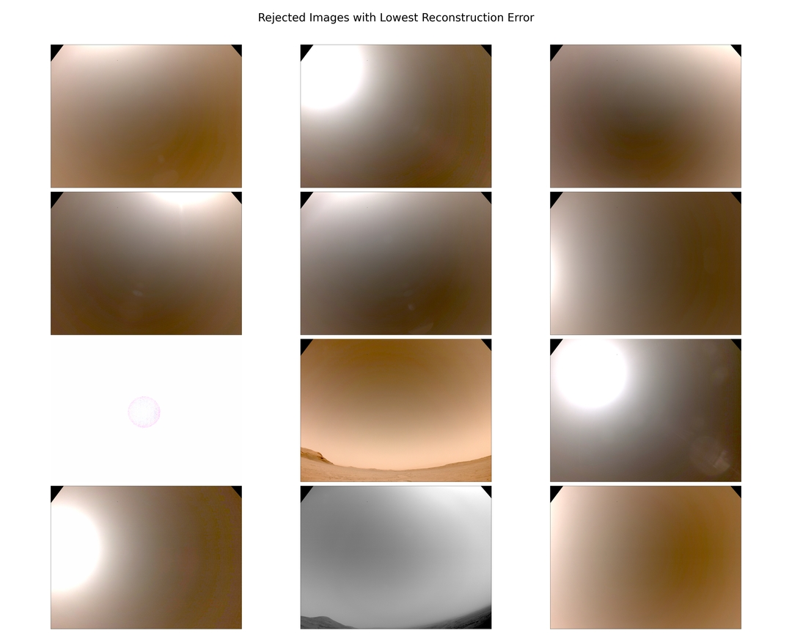
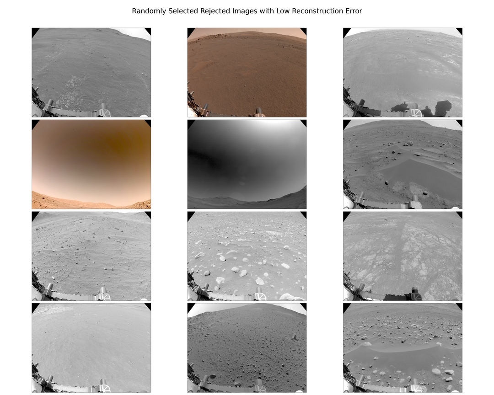

# 🚀 Edge AI for Onboard Data Prioritization (Anomaly Detection)

This project presents a proof-of-concept Edge AI system designed for **onboard data prioritization and selective transmission** in bandwidth-constrained environments, such as planetary missions.

The system simulates how spacecraft (or other edge devices) can automatically select and transmit only the most valuable data using anomaly detection.

---

## 🧠 Problem

Modern space missions generate massive amounts of visual data, while communication bandwidth remains extremely limited.

As a result:

* most data cannot be transmitted,
* valuable observations may be delayed or lost,
* manual prioritization is not scalable.

---

## 💡 Solution

This project implements an **onboard AI pipeline** that:

1. Processes incoming images
2. Computes anomaly scores using an autoencoder
3. Ranks images by importance
4. Simulates selective transmission under bandwidth constraints

---

## 📊 Results
### Reconstruction Error Distribution



### Example Outputs

**Top anomalies (selected for transmission - 1%):**



**Lowest-error images (rejected):**


**Random Low-error images (rejected):**


### Key Metrics

- Inference throughput: ~11 images/sec  
- Avg latency: ~0.088 s/image  
- Data reduction: up to 99%

## ⚙️ Pipeline Overview

```
run_inference.py
↓
simulate_transmission.py
↓
generate_report.py
```

---

## 📊 Features

* Autoencoder-based anomaly detection
* Image prioritization using reconstruction error
* Simulation of transmission scenarios:

  * 10%
  * 5%
  * 1%
* Performance metrics (inference time, throughput)
* Visual reports and plots

---

## ▶️ Quick Start

### 1. Clone repository

```
git clone https://github.com/pevu97/edge-ai-anomaly-detection.git
cd edge-ai-anomaly-detection
```

---

### 2. Install dependencies

```
pip install -r requirements.txt
```

---

### 3. ⚠️ IMPORTANT – Clean previous results

Before running the pipeline, **you must clear the contents of the folder**:

```
simulation/results/
```

Otherwise:

* results will be duplicated
* reports may become inconsistent

---

### 4. Run full pipeline

```
python run_inference.py
python simulate_transmission.py
python generate_report.py
```

---

## 📈 Output

After execution:

### `inference results/`

* inference_records.json
* inference_summary.json

### `simulation results/`
* scenario_10pct.csv
* scenario_5pct.csv
* scenario_1pct.csv
* selected image folders
* transmission_summary.json

### `report/`

* histograms
* comparison tables
* selected image visualizations
* rejected image examples
---

## 🧪 Demo Dataset

The model was developed and evaluated using images from NASA's Perseverance rover (Mars 2020 mission), specifically NAVCAM (Navigation Camera) data.

Characteristics of the dataset:
- Source: NASA PDS Imaging Atlas
- Camera: NAVCAM (left/right)
- Image type: mostly grayscale navigation images
- Resolution: typically ~1024x1024 (resized to 256x256 for training)
- Dataset size: ~50,000 images (filtered and deduplicated)

Preprocessing steps included:
- near-duplicate removal (perceptual hashing)
- grayscale normalization
- filtering of unusable frames (e.g., rover-dominant or ground-only images)

The repository includes a **small sample dataset** for demonstration.

Full experiments were conducted on a significantly larger dataset (~50k images), not included due to size.

---

## ⚡ Performance

Example results:

* ~11 images/sec inference throughput
* ~0.088 s per image
* up to **99% data reduction**

---

## 🛰️ Use Cases

* Planetary missions (Mars rovers, orbiters)
* Autonomous satellites
* Remote sensing systems
* Edge AI systems
* Drone-based exploration

---

## 🚧 Future Work

* Edge deployment (embedded hardware)
* Multi-modal data
* Real-time processing
* Improved anomaly detection

---

## 📬 Contact

Author: **[Patryk Wieczorek]**
GitHub: https://github.com/pevu97

---

## 📄 License

Research / demonstration purposes.
